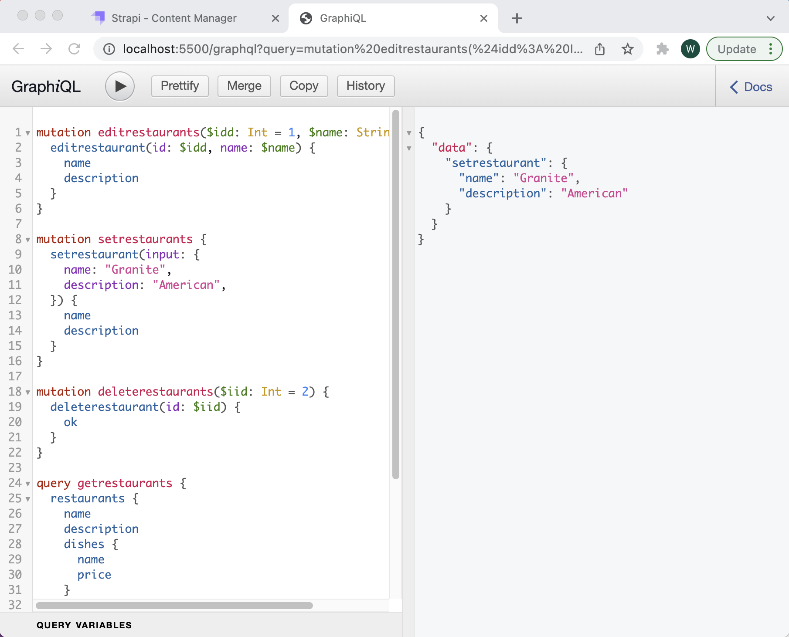
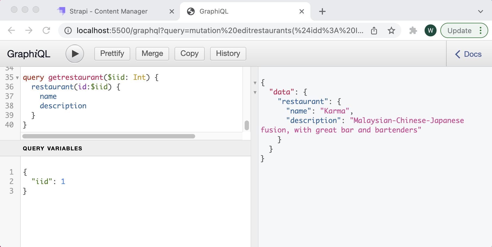
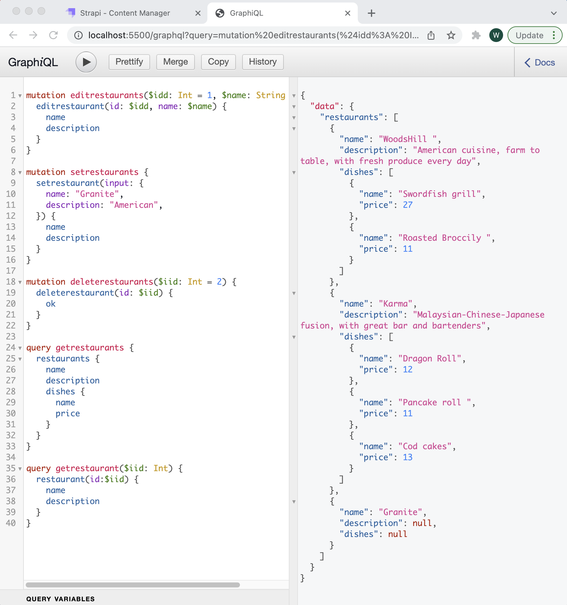
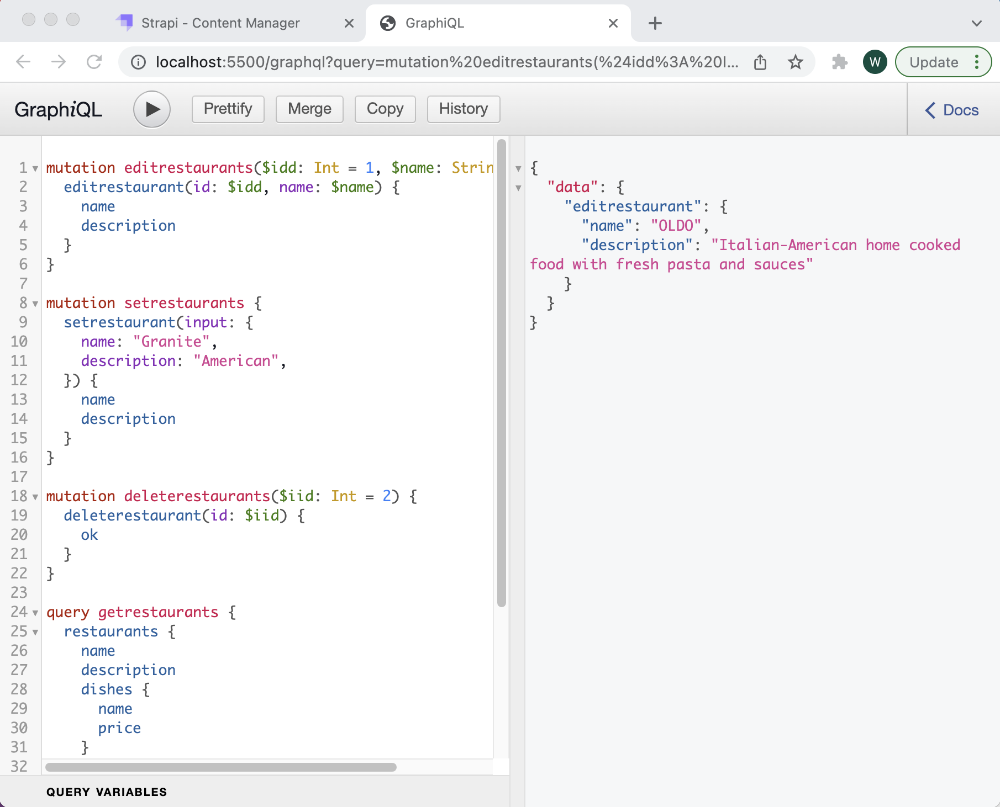
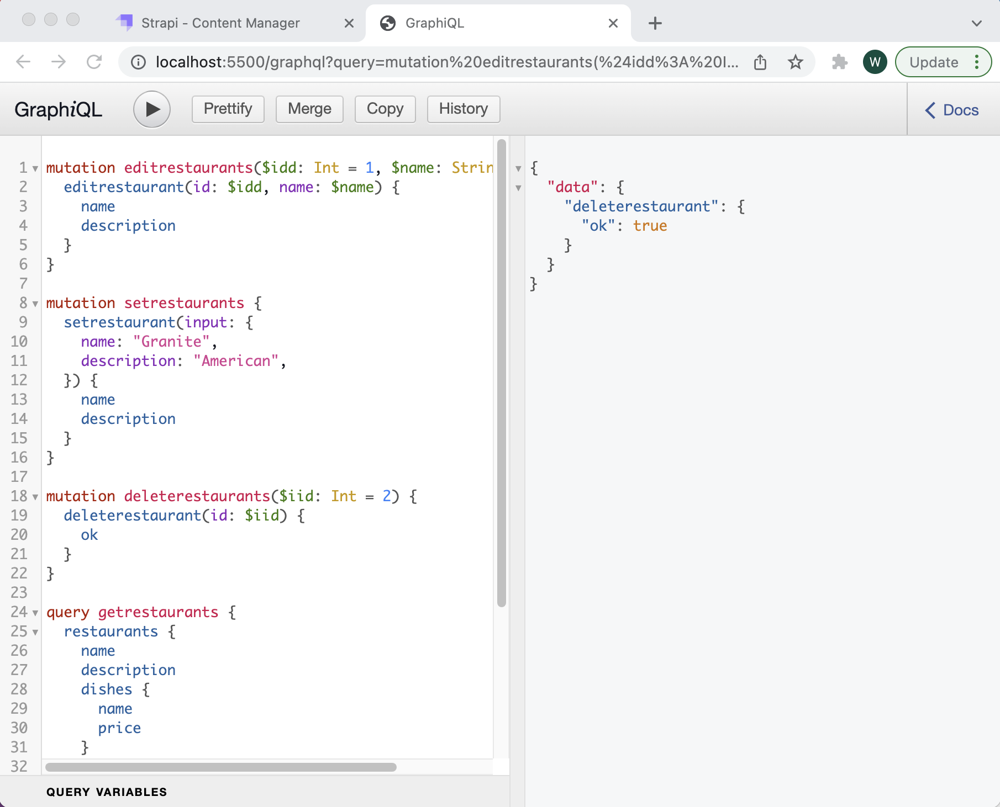

# GraphQL
GraphQL CRUD Activities for restaurant list
<ol>
   <li>
    <h4>Create</h4>
    
  </li>
  <li><h4>Retrieve</h4>
    <ul>
      <li>
        <h4>By ID</h4>
        
      </li>
      <li>
        <h4>All</h4>
        
      </li>
    </ul>
  <li>
    <h4>Update</h4>
    
  </li>
   <li>
     <h4>Delete</h4>
    
  </li>
  </ol>
